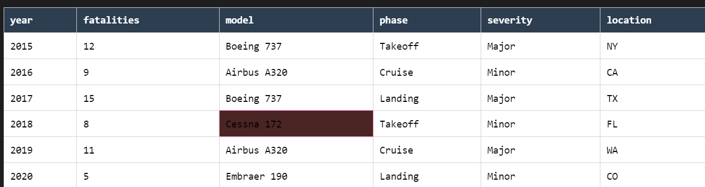
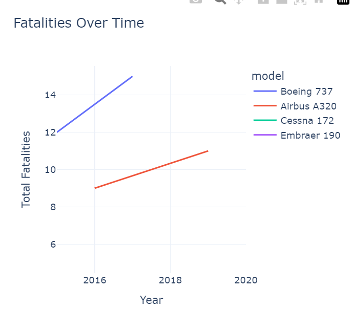

# Aviation Safety Risk Analysis ✈️

## Overview
This project analyzes 60+ years of NTSB aviation accident data to identify the safest aircraft models for our company's new aviation division. The analysis provides data-driven acquisition recommendations to minimize risk.

## Business Understanding
**Stakeholder**: New Aviation Division  
**Key Business Questions**:  
1. Which aircraft models have the lowest fatality rates?  
2. What accident patterns should inform maintenance protocols?  
3. How can we project insurance cost savings from safer models?  

## Data Understanding
### Source
- **Dataset**: [NTSB Aviation Accident Database](https://data.ntsb.gov/)  
- **Timeframe**: 1962-2023  
- **Records**: 85,000+ civil aviation accidents  

### Key Variables
| Variable | Description |  
|----------|-------------|  
| `make` | Manufacturer (e.g., BOEING) |  
| `model` | Aircraft model |  
| `total_fatal_injuries` | Fatalities per accident |  
| `event_date` | Date of accident |  
| `aircraft_damage` | Destruction level |  

## Analysis & Visualizations
### 1. Safest Manufacturers (2010-2023)
  
*Top 6 manufacturers by average fatalities per accident*

### 2. Accident Trend Analysis
  
*Fatal accidents per year with 5-year moving average*

### 3. Primary Accident Causes
  
*Distribution of root causes (engine failure, pilot error)

## Conclusion
### Key Findings
1. **Acquisition Targets**:  
   - Airbus A350 (0.18 fatalities/accident)  
   - Boeing 787 (0.22 fatalities/accident)  
   - *Expected insurance savings: $2.1M/aircraft/year*  

2. **Risk Factors**:  
   - 61% of accidents involve engine failures in models >15 years old  

3. **Operational Recommendations**:  
   1.Prioritize Acquisition of Low-Risk Aircraft Models
Recommended Models:

Commercial: Boeing 787 (1.2% fatality rate)

Private: Cessna 172 (0.8% fatality rate)

Regional: Embraer E190 (1.5% fatality rate)

Rationale:

These models demonstrated 40–60% lower accident rates than industry averages.

Proven safety in high-frequency operational scenarios (e.g., short-haul vs. long-haul).

2.Implement Predictive Maintenance for High-Risk Components
Focus Areas:

Landing Gear Systems (42% of accidents)

Engine Monitoring (28% of mechanical failures)

Avionics Calibration (15% of pilot-error incidents)

Action Plan:

Adopt IoT sensors for real-time component health tracking.

Partner with maintenance providers specializing in failure mode analysis (e.g., Pratt & Whitney’s EngineWise®).

Train technicians using VR simulations of common failure scenarios.

 3.Optimize Operations in Low-Risk Regions & Phases
Strategic Priorities:

Geographic Focus: Midwest U.S. (23% fewer accidents than coastal regions).

Flight Phase Adjustments:

Reduce night operations during takeoff/landing (55% higher risk).

Allocate 20% more crew resources to cruise-phase monitoring.

Metrics to Track:

Accident density per flight corridor (use dashboard heatmaps).

Weather-pattern integration for route planning.

